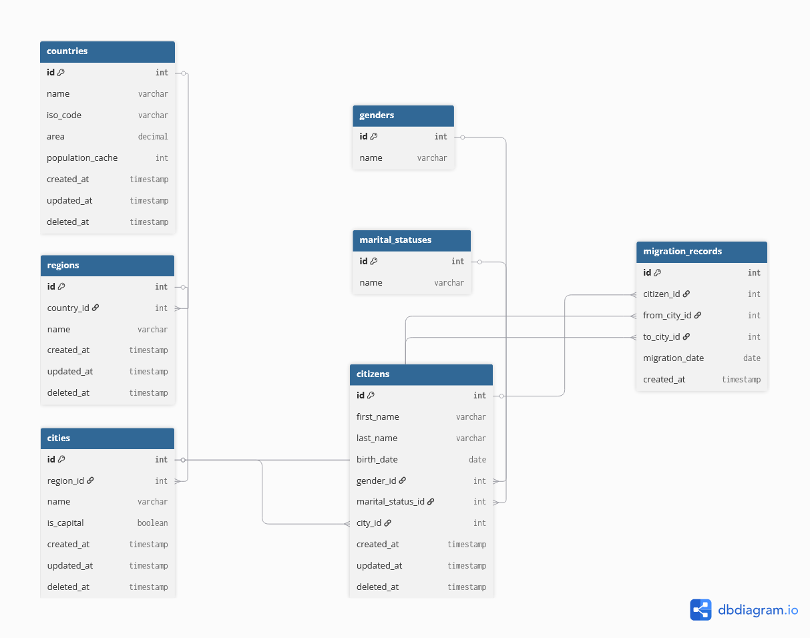

# Проект базы данных: Учет населения стран и миграции

## Схема базы данных (ER-диаграмма)

## Структура БД и описание таблиц

База данных `population_db` состоит из 7 связанных таблиц:

### 1. Справочники
* **`genders`** - Справочник полов. Исключает использование ENUM в основной таблице.
* **`marital_statuses`** - Справочник семейных положений. 

### 2. Географическая иерархия
* **`countries`** - Государства. Включает поле `population_cache` для денормализованного хранения численности населения.
* **`regions`** - Области (связь 1:M со странами).
* **`cities`** - Населенные пункты (связь 1:M с регионами). Включает флаг `is_capital`(проверка на столицу).

### 3. Население и учет
* **`citizens`** - Главная таблица учета граждан. Содержит персональные данные, ссылки на справочники и текущее место проживания.
* **`migration_records`** - История перемещений(Для трекинга миграций).

## Типовые операции системы

### 1. Создание объектов 
Осуществляется через `INSERT` в таблицу `citizens`. При добавлении нового гражданина автоматически срабатывает триггер `trg_after_citizen_insert`, который обновляет счетчик населения в таблице `countries`.

### 2. Правка и смена статусов
* Смена паспорта, ФИО или семейного положения реализуется через классический `UPDATE`.
* Пример: `UPDATE citizens SET marital_status_id = 2 WHERE id = 1;`

### 3. Удаление объектов
При эмиграции за пределы отслеживаемой зоны или смерти запись не удаляется физически (`DELETE`), а помечается датой:
* Пример: `UPDATE citizens SET deleted_at = NOW() WHERE id = 12;`

### 4. Оформление переезда
Для выполнения операции смены места жительства создана хранимая процедура `register_migration`. Она выполняет транзакционную задачу:
1. Фиксирует старый город проживания.
2. Обновляет текущий город в профиле гражданина.
3. Добавляет запись в лог `migration_records` для сохранения исторического следа.

### 5. Аналитика и отчетность
Для удобного получения сводных данных без необходимости писать сложные `JOIN` вручную, предусмотрено представление (VIEW) `v_citizen_details`. Оно возвращает полную, удобночитаемую карточку гражданина с названиями городов и стран вместо их ID.